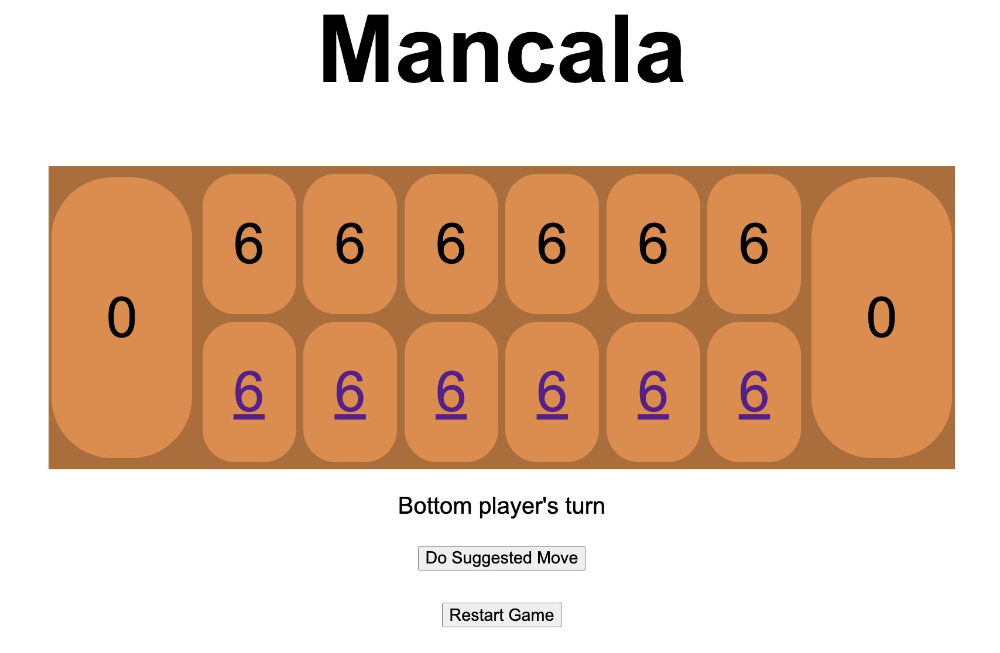
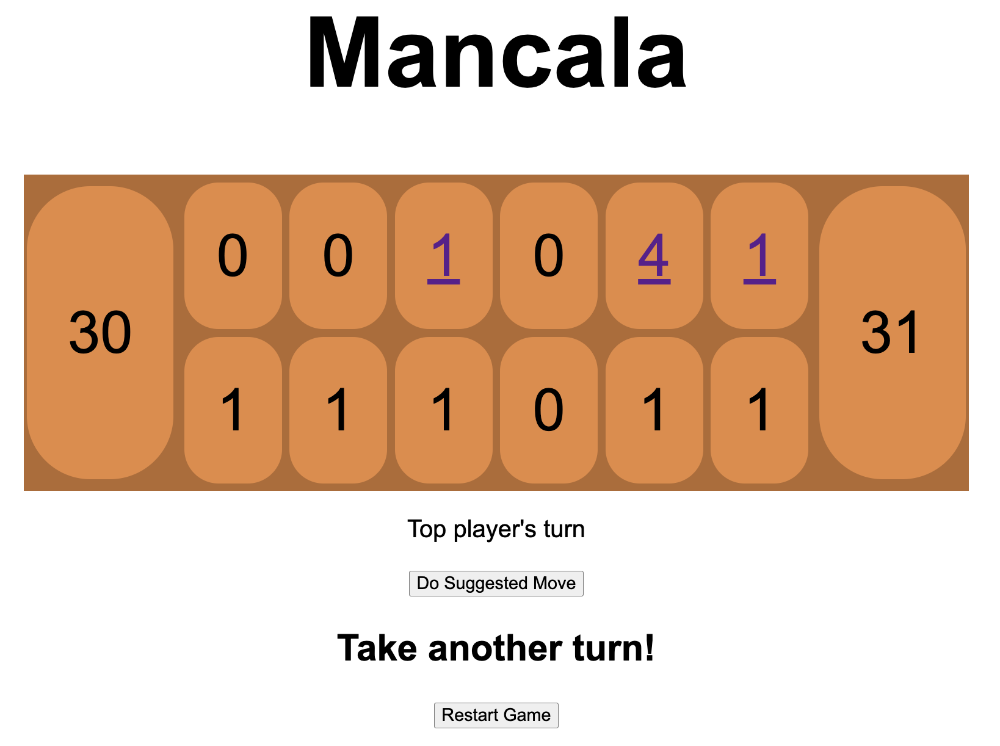

A Mancala game implemented via a Java webserver and Java Server Pages.

Run using `mvn spring-boot:run` in the command line, then navigate to `http://localhost:8082/` in a browser.

Features:
* A move suggester which lets also lets you play vs. the computer
* The frontend clearly indicates whose turn it is and disables invalid moves
* All game logic is implemented in the backend and useful messages are displayed when, for example, stones are captured or someone gets an extra turn

Feature TODOs:
* While hovering over a pit, highlight the pit that you'd end in after playing from here
* Animate moves to clarify what's happening
* Make the board prettier, perhaps with images of real stones
* Make it clearer which direction play is in and whose goal is whose
* Add an undo button

Beginning setup:

Example midgame:

